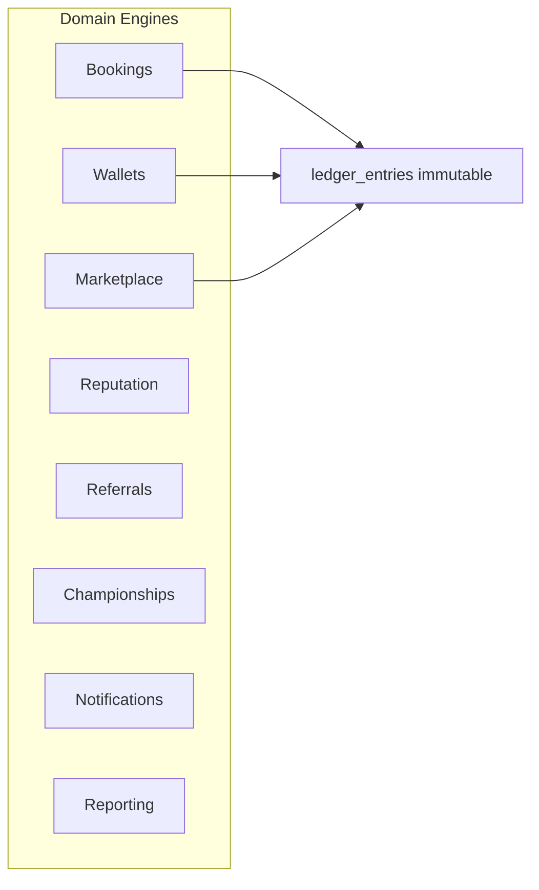

# Domain Architecture

## Modular engines



| Engine | Path | Phase |
|--------|------|-------|
| Ledger | `server/src/domain/ledger/` | 1 |
| Wallet | `server/src/domain/wallet/` | 1 |
| Deposits | `server/src/domain/deposits/` | 1 |
| Booking | `server/src/domain/booking/` | 1 |
| Capacity | `server/src/domain/capacity/` | 1 |
| Waitlist | `server/src/domain/waitlist/` | 1 |
| Marketplace reservations | `server/src/domain/marketplace/` | 1 |
| Reputation | `server/src/domain/reputation/` | 2 |
| Championship | `server/src/domain/championship/` | 2 |
| Dynamic deposits | `server/src/domain/deposits/dynamic.ts` | 2 |
| Fraud / partners / gift cards | `server/src/fraud/`, `partners/`, `giftCards/` | 3 |
| Tax export | `server/src/exports/taxReport.ts` | 3 |
| Network rollup | `server/src/admin/networkRollup.ts` | 3 |

## Ledger principle

Every state change appends `ledger_entries`:

```
id, entity_type, entity_id, event_type, payload_json, actor_id, created_at
```

Wallet balances are cached; reconciliation compares sum(transactions) vs balance.

## Integration with existing modules

- Wraps `server/src/logic/booking.ts` — do not fork booking lifecycle
- Wraps `server/src/providerWallet/logic.ts`
- Wraps `server/src/paymentProtection/`
- Wraps `server/src/marketplace/logic.ts`
- Existing loyalty/tombola remain separate until Phase 2 migration plan
